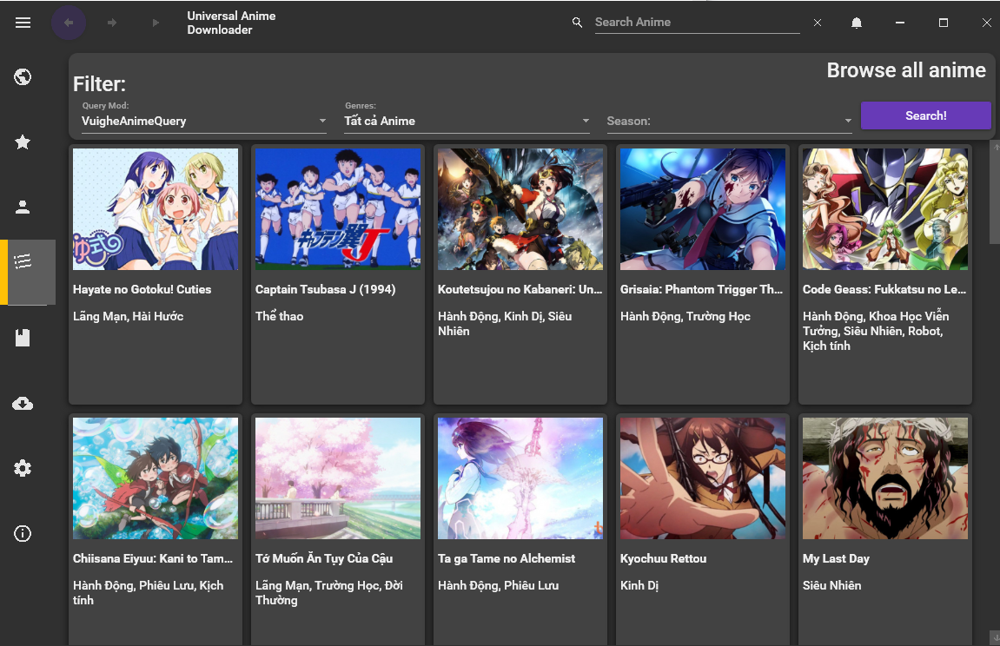
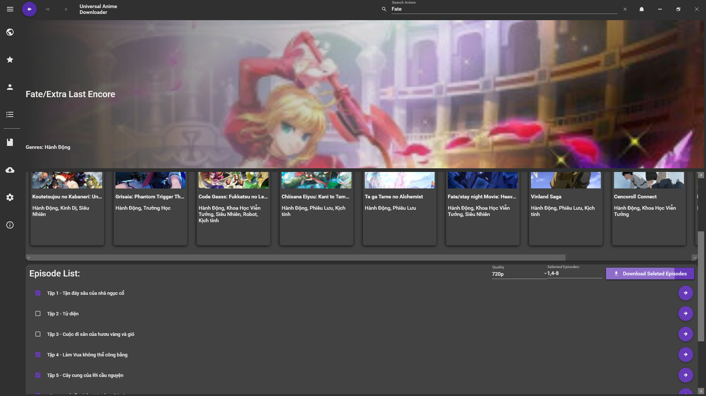
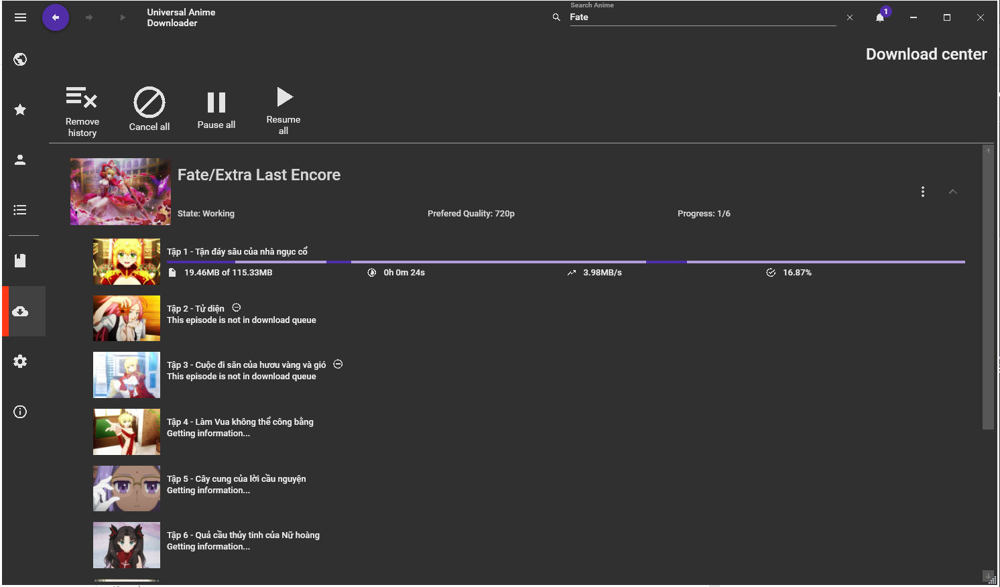
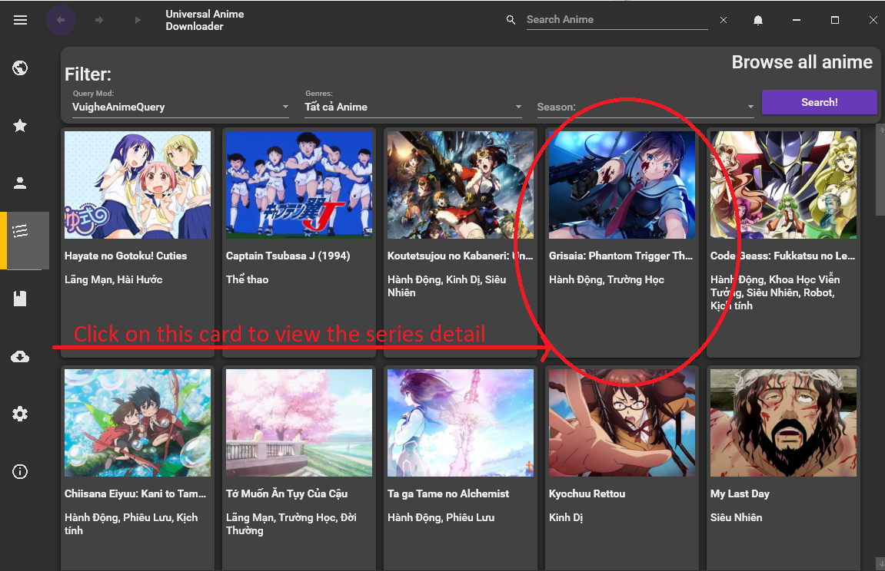
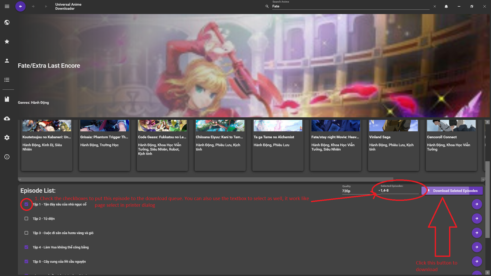
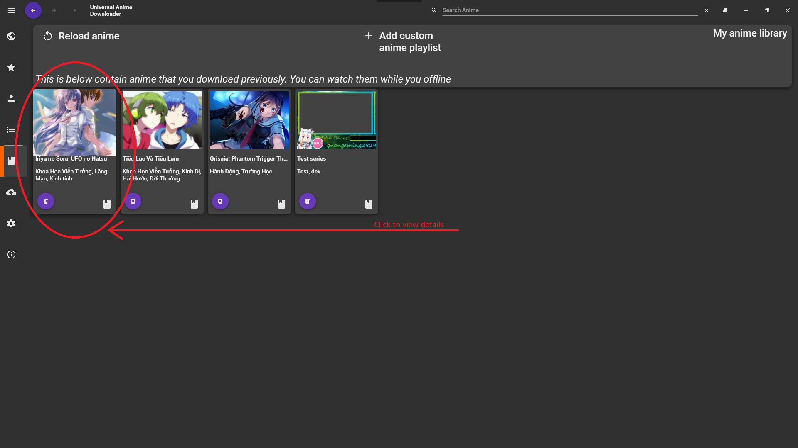
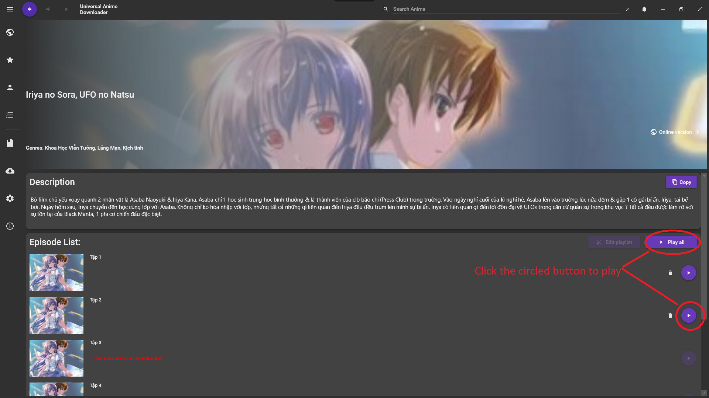

<!--

    Modified by Nguyen Hoang Duong (@NOVAglow).
    Footprints (1): ???

-->

<h1 align="center">Universal Anime Downloader</h1>

    

Table of Content
----------------

1. [What is Universal Anime Downloader?](#what-is-universal-anime-downloader)
2. [Features](#features)
3. [Install](#install)
4. [Build from source](#build-from-source)
5. [How to use UAD](#how-to-use-uad)
    - [Quick guide](#quick-guide)
    - [Detailed guide & videos](#detailed-guide-&-videos)
6. [Contributing](#contributing)
7. [Coming up in the next release](#coming-up-in-the-next-release)

What is Universal Anime Downloader?
-----------------------------------

Universal Anime Downloader (UAD) is an anime downloader & extractor. It fetches
any anime series of interest and displays it to the user. UAD is meant to make
searching and downloading anime series easier. In addition, the program's
built-in video player has a lot of unique features to enhance the user's
experience.

  
  

Features
--------

- Download a complete series of anime with a few clicks
- Search anime series by name or genre
- Anime's information (description, thumbnails, ...) is saved after download
- Download and watch anime films without a web browser (saves computer memory :+1:)
- No advertisement
- Draw on the playback screen of the video player
- Segmented download (which results in better download speed)
- Material Design UI
- Highly customizable
- Sneaky watch :eyes: <!-- Write about this in e.g. a wiki page and drop a link here -->
- Selective download for anime episodes
- Watch online
- Notify and auto-download new episodes in the Anime Library
- Official API for the custom extractor to be based on
- Suggest anime series based on previous downloads
- Show featured anime series
- Custom playlists

Install
-------

[latest]: https://github.com/quangaming2929/UniversalAnimeDownloader/releases/latest

**Prerequisites**:

- Operating system: Windows 7 or later
- .NET framework version 4.7.2 or later

**Instructions**:

1. Download the latest version [here][latest] (choose the `UADInstaller1.0.exe`
file).
2. Run the EXE file. If Windows Smartscreen displays a warning, proceed by
clicking "Learn more" and then "Run anyway".
3. Click "Install" to install Universal Anime Downloader.

Build from source
-----------------

> **Note**: This section is only for Visual Studio users. If you use another
code editor or IDE, please consult the Internet on how to reproduce these steps
in your favorite program.

<!-- Commenting this out because it's ja ja ja ja blah blah blah blah

If you pay attention, you may wonder why you need to remove the project and
readd the prebuilt one for SegmentedDownloader. This is due to the fact that I
moded these libraries to allow me to add custom header when downloading, so I
place this project outside of Git repos folder. When you clone this repos, these
projects will failed to load

-->

**Prerequisites**:

- Operating system: Windows 7 or later
- A text editor or an IDE with support for .NET framework (Visual Studio 2017
and Visual Studio 2019 are recommended)
- .NET desktop development workload

**Instructions**:

1. Clone this repository.
2. Open the solution using Visual Studio. <!-- ??? Be specific, WHAT solution? -->
3. There might be several projects that do not reference correctly to the UI
project. <!-- ??? These projects reference to or being referenced?!?! --> To
solve this, delete the references and re-add them or re-download them using the
Nuget Package Manager.
4. Remove the references to `SegmentedDownloader.Core` and
`SegmentedDownloader.Protocol` from the project UniversalAnimeDownloader and
re-add their pre-built DLLs when you download UAD. <!-- ??? Need clarification -->
5. Remove `SegmentedDownloader.Core` and `SegmentedDownloader.Protocol` from the
solution.
6. Press `F5` or click _Start_ to build Universal Anime Downloader.

How to use UAD
--------------

### Quick Guide

1. Search for anime series in the _All Anime_ page. Then download the interested
anime series by clicking on the anime "card", and select the episodes you
want to download by clicking on the corresponding check boxes, and then click
_Download all_.

  

2. All downloaded anime series are located in the _My Anime Library_ section,
displayed using rectangular cards. To watch one, just click the play button.

  

### Detailed guide & videos

> **Note**: This is meant for UAD 0.8.0

I've created a video instruction for UAD, so [check it out][en-guide]. A similar
video but is intended for Vietnamese users can be found [here][vi-guide].

Assets used to make the videos are available publicly [here][materials].

<!-- ??? Please re-state this statement
<h4>All functionality are simillar for v0.9.0 but difference UIs, new feature will be covered in Video Tutorials</h4>
-->

[en-guide]: https://drive.google.com/open?id=1-8O5G7YrnI_KLZiXz6BZ0F5LoKYYVSsG
[vi-guide]: https://drive.google.com/open?id=1cwXjiAtqJMBDYsLpmXqHf-o8mZchk2K0
[materials]: https://drive.google.com/open?id=1eHobBKnt9ruD1-Cqc-kKu2RLc8qq6cJT

Contributing
------------

Currently, I'm working alone on this project. I'm working on major updates for
UAD and the amount of work to get it done is immense, so I'd appreciate your
contributions a lot. Pull requests are welcome.

<!-- ??? Provide your e-mail address or be specific on how to contribute
e.g by opening a pull request -->

Coming up in the next release
-----------------------------
- Built-in interactive manual
- Play HLS inside the application window and download them  <!-- ??? HLS? -->
- _Mod Gallery_ section, where you can download mods for UAD

You can request a new feature by [opening an issue][issues].

[issues]: (https://github.com/quangaming2929/UniversalAnimeDownloader/issues)

<!-- ???

License
-------

-->
